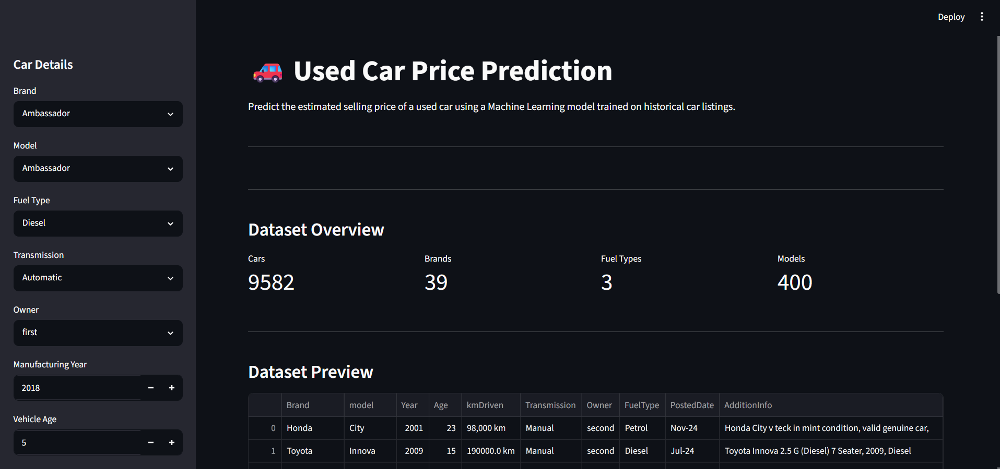
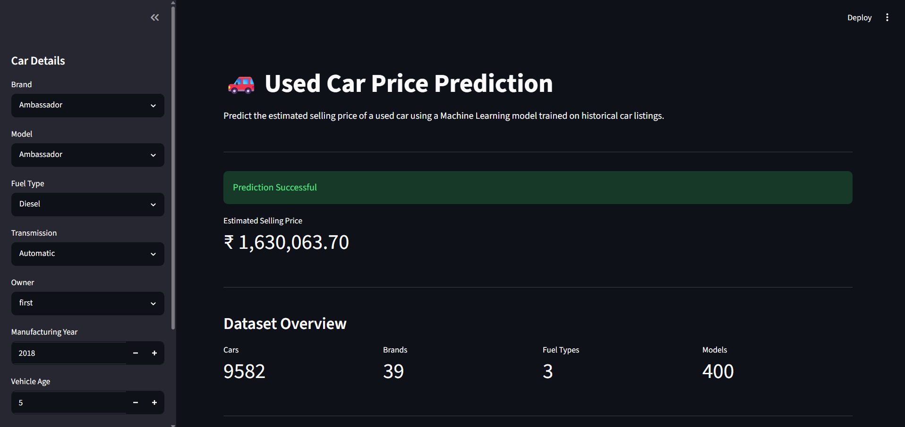

# 🚗 Used Car Price Prediction using Machine Learning

A Machine Learning web application that predicts the estimated selling price of a used car using **Linear Regression**. The application uses **MongoDB Atlas** for storing the dataset, **Scikit-learn** for model training, and **Streamlit** for the user interface.

---

# 📌 Project Overview

This project demonstrates a complete Machine Learning workflow, including:

- Data storage using MongoDB Atlas
- Data loading with Pandas
- Data preprocessing
- Model training using Linear Regression
- Model serialization using Joblib
- Interactive web interface using Streamlit

The application allows users to enter car details and instantly receive an estimated selling price.

---

# ✨ Features

- 🚗 Used car price prediction
- ☁️ MongoDB Atlas cloud database integration
- 📊 Automatic data loading using Pandas
- 🧹 Data preprocessing pipeline
- 🤖 Linear Regression model
- 💾 Saved trained model using Joblib
- 🎨 Interactive Streamlit dashboard
- 📈 Dataset overview
- 🔍 Brand-wise model selection

---

# 🛠️ Tech Stack

## Programming Language

- Python

## Database

- MongoDB Atlas

## Machine Learning

- Scikit-learn
- Pandas
- NumPy

## Web Framework

- Streamlit

## Other Libraries

- PyMongo
- Joblib
- Python-dotenv

---

# 📂 Project Structure

```text
Used-car-prediction/
│
├── database/
│   └── mongodb.py
│
├── data/
│   └── data_loader.py
│
├── preprocessing/
│   └── preprocessing.py
│
├── model/
│   ├── train.py
│   ├── predict.py
│   └── model.pkl
│
├── app.py
├── requirements.txt
├── README.md
├── .gitignore
└── .env
```

---

# 📊 Dataset

The dataset contains information about used cars such as:

- Brand
- Model
- Manufacturing Year
- Vehicle Age
- Kilometers Driven
- Transmission
- Owner
- Fuel Type
- Asking Price

Total Records:

- **9582 Cars**

---

# ⚙️ Installation

## 1. Clone the repository

```bash
git clone https://github.com/yourusername/Used-car-prediction.git

cd Used-car-prediction
```

---

## 2. Install dependencies

```bash
pip install -r requirements.txt
```

---

## 3. Configure MongoDB Atlas

Create a `.env` file in the project root.

```env
MONGODB_URI=YOUR_MONGODB_CONNECTION_STRING

DATABASE_NAME=used_car_db

COLLECTION_NAME=cars
```

---

## 4. Train the model

```bash
py -m model.train
```

This generates the trained model:

```text
model/model.pkl
```

---

## 5. Run the Streamlit application

```bash
streamlit run app.py
```

---

# 🚀 How It Works

1. Connects to MongoDB Atlas.
2. Loads the dataset into a Pandas DataFrame.
3. Cleans and preprocesses the data.
4. Trains a Linear Regression model.
5. Saves the trained model.
6. Loads the model inside the Streamlit application.
7. Predicts the estimated selling price based on user inputs.

---

# 📷 Application Preview

### Home Page



---

### Prediction Result



---

# 📈 Machine Learning Workflow

```text
MongoDB Atlas
        │
        ▼
Data Loader
        │
        ▼
Data Preprocessing
        │
        ▼
Train-Test Split
        │
        ▼
Linear Regression
        │
        ▼
Model Saving (Joblib)
        │
        ▼
Prediction
        │
        ▼
Streamlit Web Application
```

---

# 📌 Future Improvements

- Random Forest Regressor
- XGBoost Regressor
- Better Feature Engineering
- Hyperparameter Tuning
- Model Comparison Dashboard
- Deployment on Streamlit Cloud
- Docker Support
- User Authentication

---

# 📚 Learning Outcomes

This project helped in understanding:

- MongoDB Atlas Integration
- Data Preprocessing
- Regression Algorithms
- Machine Learning Pipeline
- Model Serialization
- Streamlit Development
- Python Project Structure

---

# 👨‍💻 Author

**Sagnik Ghosh**

Mechanical Engineering Undergraduate  
National Institute of Technology Durgapur

GitHub:
https://github.com/Sagnik0310

---
**Mentioning Anantika Ghosh for her collaboration**

# ⭐ If you like this project

Please consider giving this repository a ⭐ on GitHub.